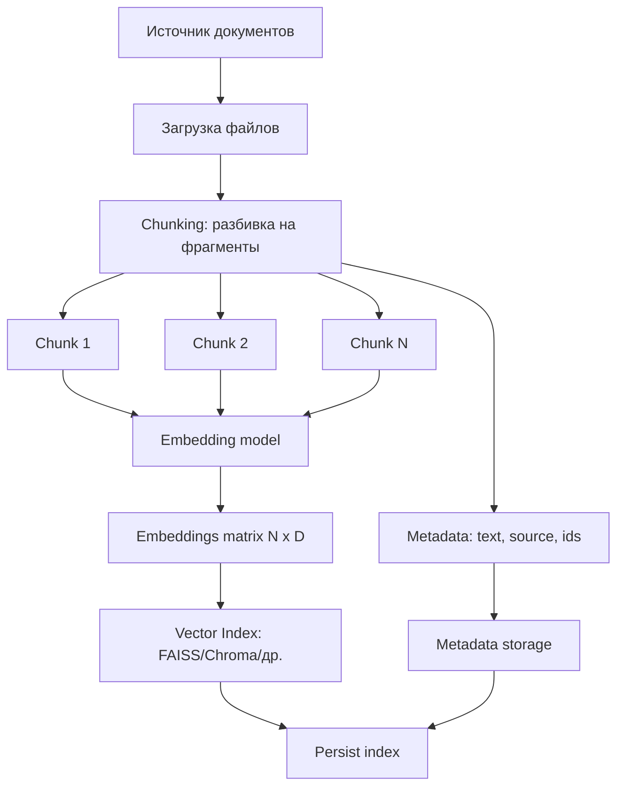

# Краткий конспект по RAG: embeddings, индекс, хранение, поиск

Этот документ — краткое резюме исследования по тому, как устроен RAG-процесс в проекте и какие практические выводы важны для разработки.

## 1) Что такое embedding в RAG

- `Embedding` — это вектор (`List[float]`) фиксированной размерности, который представляет смысл текста.
- В типовом пайплайне: `1 chunk -> 1 embedding`.
- Для корректного поиска документы и пользовательские запросы должны быть в одном embedding-пространстве (одна и та же embedding-модель/версия).
- Если меняем embedding-модель, индекс нужно переиндексировать.

## 2) Подготовка данных (chunking)

- Большой текст режется на чанки, чтобы:
  - не терять релевантные фрагменты из-за длинного документа;
  - управлять размером контекста для retrieval/LLM;
  - повышать точность семантического поиска.
- Качество RAG сильно зависит от стратегии chunking:
  - слишком крупные чанки размывают смысл;
  - слишком мелкие чанки теряют контекст;
  - нужен баланс `chunk size`, `overlap`, `top_k`.

### Token-based chunking и альтернативы

- **`tiktoken`** (OpenAI): низкоуровневая токенизация под ту же семью кодировок, что у моделей; удобно задавать `chunk_size` и `overlap` в токенах (как в учебном фрагменте `temp2/utils/chunker.py`). Это ближе к реальным лимитам контекста, чем нарезка по символам.
- **Специализированные нарезатели** — не замена `tiktoken`, а надстройки: учитывают структуру документа, формат, предложения, семантику.
  - **Бесплатно / open-source**: LangChain (`RecursiveCharacterTextSplitter`, `TokenTextSplitter` и др.), LlamaIndex (node parsers), Haystack preprocessors, Unstructured (для PDF/HTML/Office с layout-aware разбором).
  - **Платформенно / часто paid**: встроенный ingestion и chunking в managed RAG (Pinecone, Azure AI Search, Vertex, AWS Knowledge Bases и т.п.) — меньше ручного кода, но меньше прозрачности и контроля.

Итог: `tiktoken` — база для «правильного» размера чанка в токенах; «умные» splitters добавляют эвристики и формат, иногда в связке с тем же токенайзером.

## 3) Индексирование (как создается векторный индекс)

- Загружаются документы из источника (`.txt` в текущем проекте).
- Документы разбиваются на чанки.
- Для каждого чанка вычисляется embedding.
- Список embeddings преобразуется в матрицу (`N x D`) и добавляется в векторный индекс.
- Параллельно сохраняются метаданные (текст чанка, source, id/позиция).

## 4) Хранение в текущем проекте (FAISS-реализация)

- Хранение разделено на 2 слоя:
  - `index.faiss` — бинарный индекс векторов;
  - `metadata.json` — тексты и служебные поля.
- Связь «вектор <-> метаданные» держится по индексу позиции.
- Важно: FAISS не хранит ваши Python-объекты metadata, это делает приложение.

## 5) Поиск (retrieval)

- Запрос пользователя тоже векторизуется той же моделью.
- Выполняется nearest-neighbor поиск в индексе (`top_k` ближайших векторов).
- На выходе:
  - `indices` — ссылки на найденные позиции;
  - `distances` — расстояния (для L2: меньше = ближе).
- По `indices` подтягиваются тексты/источники из metadata и собирается контекст для LLM.

## 6) Практические выводы по качеству

- Даже при наличии верных данных LLM может дать лишние варианты, если retrieval вернул семантически близкие, но нецелевые фрагменты.
- Поэтому надежный прод-подход:
  1. retrieval кандидатов;
  2. детерминированная постфильтрация (город, дата, ограничения);
  3. генерация финального ответа LLM.
- Отдельно полезно использовать `distance`:
  - для порогов релевантности;
  - для диагностики и тюнинга поиска.

## 7) Хранение и инфраструктура: краткий срез

- `FAISS` (как в проекте): максимум контроля, но metadata и часть логики — вручную.
- `Chroma`: более высокий уровень абстракции (векторы + metadata + persist), удобнее для быстрого старта.
- Для высоких нагрузок/больших объемов обычно выбирают специализированные серверные векторные БД (Qdrant, Weaviate, Milvus, Pinecone и т.д.) и проводят нагрузочные тесты на своих запросах.

### Сравнение retrieval-эффективности (практический срез)

| Аспект | FAISS | Chroma | Weaviate | Pinecone | Relevance AI |
|---|---|---|---|---|---|
| Уровень абстракции | Низкоуровневый ANN-движок | Высокоуровневая векторная БД/SDK | Полноценная векторная БД (OSS + Cloud) | Managed vector DB (SaaS) | Agent/RAG-платформа с встроенным Knowledge |
| Контроль тюнинга | Максимальный | Средний | Высокий | Ограниченный (больше managed-подход) | Ограниченный (упор на product-level настройки) |
| Скорость разработки | Низкая/средняя (много ручной логики) | Высокая | Средняя | Высокая | Очень высокая для agent/RAG-сценариев |
| Raw performance (при грамотной настройке) | Очень высокая | Средняя/высокая | Высокая | Высокая | Зависит от платформы и конфигурации pipeline |
| Фильтры и metadata | Реализуются приложением | Встроены и удобны | Встроены, богаче для прод-сценариев | Встроены, production-ready | Встроены в knowledge/workflow инструменты |
| Hybrid search / rerank | Вручную | Ограниченно/через стек | Сильная сторона (hybrid/search tuning) | Есть возможности через сервисные фичи | Есть через knowledge steps и validation pipeline |
| Масштабирование | На вашей стороне | Ограниченно для high-load | Хорошее (кластер/шардинг) | Отличное (managed scaling) | Хорошее на уровне платформы, но меньше low-level контроля |
| Где лучше применять | Кастомный high-performance RAG | MVP/прототипы и средние нагрузки | Production RAG с гибкими запросами | Быстрый прод без DevOps-нагрузки | Бизнес-автоматизация и агентные сценарии с RAG |

## 8) Блок-схема: создание embeddings и индекса

## 9) Мини-чеклист для стабильного RAG

- Фиксировать embedding-модель и ее версию.
- Хранить служебные метаданные индекса (модель, размерность, дата индексации).
- Проверять `top_k`, `chunk size`, `overlap` на реальных запросах.
- Добавлять постфильтрацию для строго бизнес-критичных полей.
- Мониторить retrieval-метрики и кейсы с нерелевантными ответами.

## 10) Reranking: зачем нужен и как выбирать подход

- `Reranking` — второй этап после retrieval: модель пересортировывает кандидатов (`top_k`) по более точной релевантности.
- Применяется, когда в контекст попадают «похожие, но лишние» фрагменты.
- В текущем проекте reranking не реализован (используется векторный retrieval + LLM-генерация).

Популярные варианты reranker-моделей:

- managed API: Cohere `rerank-v3.5`;
- open-source: `bge-reranker-v2-*`, `Qwen*-Reranker`, cross-encoder модели.

Про OpenAI:

- отдельного классического `rerank()` API обычно не используют как отдельный продукт;
- чаще делают LLM-based rerank (промпт + оценка/пересортировка) или подключают внешний reranker.

Практический вывод:

- кастомный LLM-based rerank дает максимум гибкости и доменной настройки;
- но повышает риск ошибок/нестабильности (недетерминизм, промпт-зависимость, сложнее тестирование);
- готовый специализированный rerank API обычно менее гибкий, но более предсказуемый и проще в эксплуатации.

## 11) Метаданные в векторных БД: практический вывод

- В production-RAG важны не только векторы, но и связка `vector + metadata`.
- Метаданные нужны для:
  - фильтрации retrieval (например, по источнику, дате, типу документа);
  - объяснимости ответа (показать источник);
  - операционных задач (обновление/удаление чанков по документу).

Кратко по инструментам:

- `FAISS`: metadata не хранит нативно; mapping и хранение metadata делаются в приложении.
- `Chroma`: хранит metadata вместе с документами/векторами; поддерживает `where`-фильтры.
- `Weaviate`: schema-first подход (свойства объекта по типизированной схеме).
- `Pinecone`: metadata как flat JSON с ограничениями по типам/формату.

Вывод по проекту `temp` (Chroma + LangChain):

- `loader` автоматически читает содержимое файлов и режет на чанки, вручную текст передавать не нужно.
- Поля `source` и `file_path` в `chunk.metadata` добавлены не только для логов:
  - они участвуют в практическом retrieval-слое (фильтры, источники, трассировка).
- Если эти поля не добавлять, поиск все равно работает, но система теряет управляемость и прозрачность.
